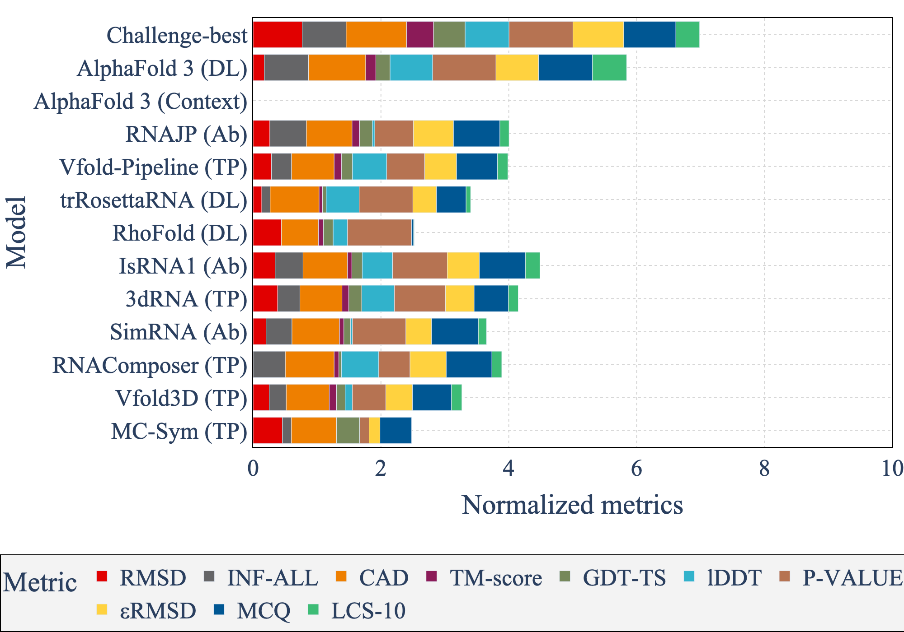
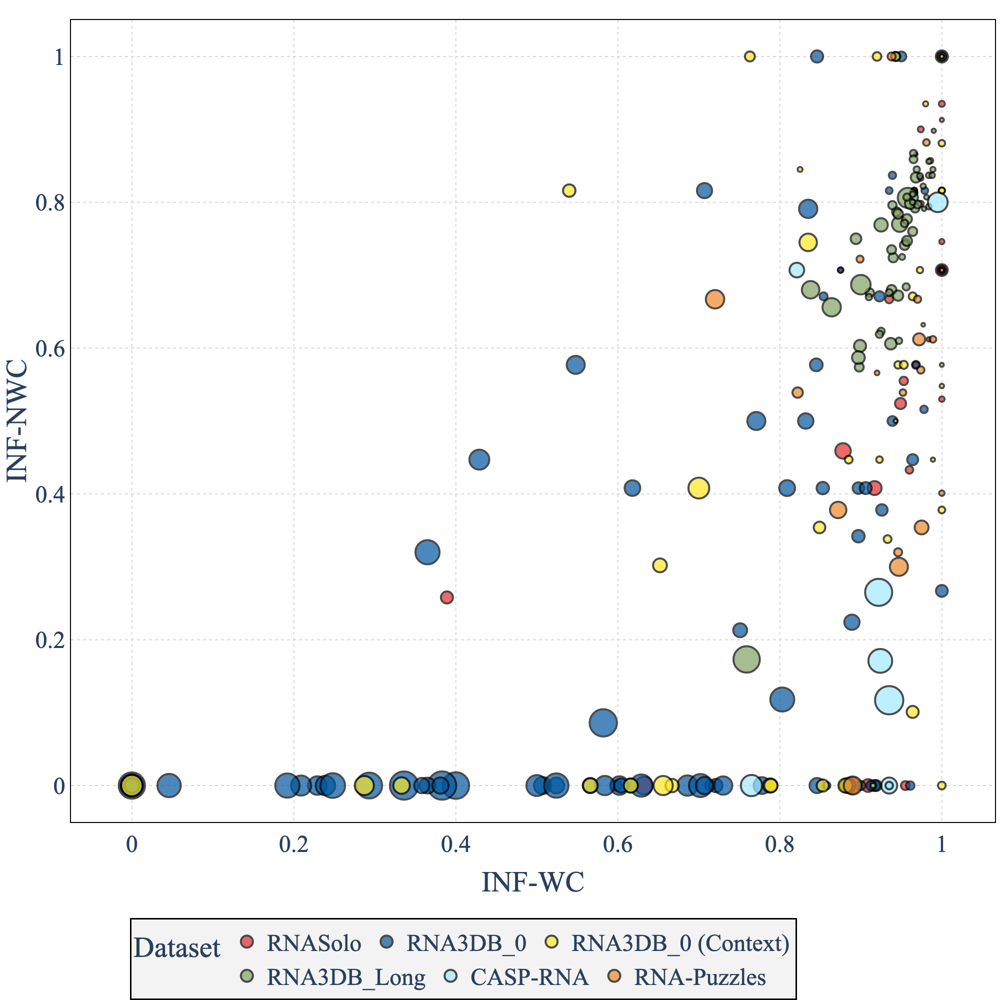
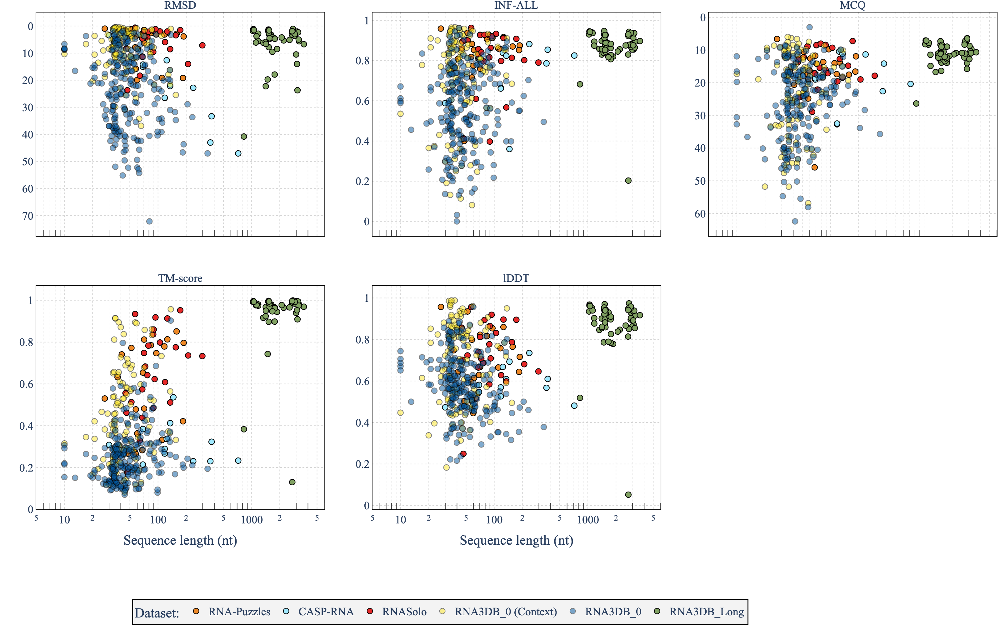
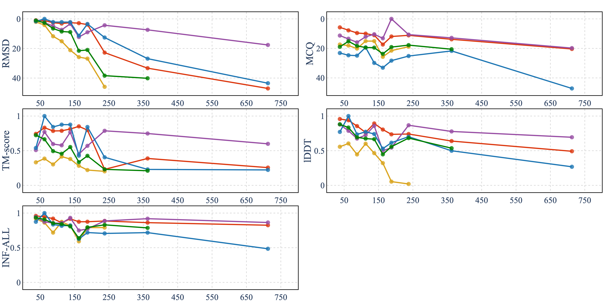
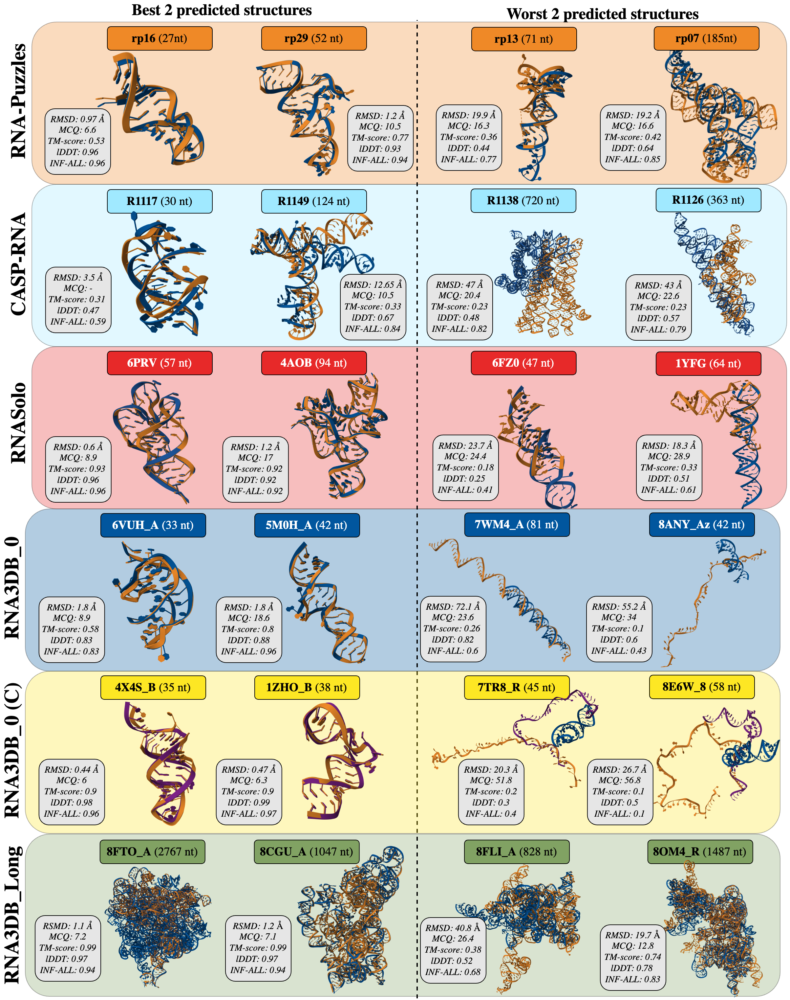

# AlphaFold 3 for RNAs benchmark

<div align="center">
<a href="https://doi.org/10.1093/nargab/lqae048" target="_blank" title="Go to article"></a>
<a name="readme-top"></a>

This repository is the source code for the visualisations of [AlphaFold 3 benchmark for RNA](https://www.biorxiv.org/content/10.1101/2024.06.13.598780v2)
<br> It also contains the structures for each prediction for the <br> five test sets: `RNA_PUZZLES`, `CASP_RNA`, `RNASOLO`, `RNA3DB_0` and `RNA3DB_LONG`.

[![Article][article_img]][article_url]
[![License][repo_license_img]][repo_license_url]

<a name="readme-top"></a>


</div>


## Folder

You will find the following folders:
- `data`: contains the data used for the visualisation
  - `info`: contains metadata computed for the predictions or datasets. We advise not to compute it again (the command to run code to compute it is available in the `Makefile`)
  - `orphans`: contains original structures with or without context for the `RNA3DB_0` dataset. It can be downloaded at this [link](https://drive.google.com/file/d/1JlXJ0G0H7YcXIEh_9LEmhBSkoaeuqg_1/view?usp=sharing)
  - `output`: contains the metrics computed for each prediction
  - `paper`: contains the figures used in the paper (main and supplementary)
  - `plots`: contains the plots generated for the visualisation. This is where are saved the outputs of the visualisation code available in this repository.
  - `pdb`: contains the structures predicted by AlphaFold 3 and the benchmarked models. 
   Should be downloaded at this [link](https://drive.google.com/file/d/1xGc9eBM4SYE4UnMI04n6EOa82lfVIjL7/view?usp=sharing). 
- `src`: contains the source code for the visualisations
- `Makefile`: file with the main commands summarized
- `environment.yml`: file with the different python requirements to run the code

## Installation

To install the required libraries, you can use the following command:

```bash
conda env create -f environment.yml
conda activate af3
```

## Data

<div align="center">

</div>


To get all the `.pdb` files, you have to unzip the [pdb folder](https://drive.google.com/file/d/1xGc9eBM4SYE4UnMI04n6EOa82lfVIjL7/view?usp=sharing).
If you need the original structures for the `RNA3DB_0` dataset (with the context), you can download them [here](https://drive.google.com/file/d/1JlXJ0G0H7YcXIEh_9LEmhBSkoaeuqg_1/view?usp=sharing).

Note that to run the visualisations, you do not need to have the original `.pdb` files. 
Visualisations are made from either metadata or directly computed scores (available in the `data/output` folder).


## Visualisations

### Raw visualisations

To reproduce the visualisation available in `data/plots`, you just need to use:

```bash
make viz_alphafold
```

or its python equivalent:

```bash
python -m src.viz_alphafold
```

It will save the plots in the `data/plots` folder.

You will find some of the following plots:

Bar chart       |                        nWC plot                         |                        Scatter plot                         |                           Scatter mean                           
:---:|:-------------------------------------------------------:|:-----------------------------------------------------------:|:----------------------------------------------------------------:|
 |  |  |  | 

To further see which code is used to generate the visualisations, you can check the `src/viz_alphafold.py` file.

Particularly, you can have a look at the `run` method: 

```python
    def run(self):
        df = self.get_merged_model_df()
        table_helper = TableHelper(df, self.save_dir)
        table_helper.run()
        table_helper.show_context_vs_no_context()
        ComputePValue(df).run()
        nwc_helper = NWCHelper(df, self.save_dir)
        nwc_helper.get_viz()
        scatter_helper = ScatterHelper(df, self.save_dir)
        scatter_helper.get_viz()
        scatter_helper.get_viz_mean()
        scatter_helper.get_viz_diff()
        BarHelper.get_viz()
```

Each class corresponds to a different type of plot, which are available in the `src/viz` folder. 

### Paper visualisations

The clean visualisations of the paper are available in the `data/paper` folder. 



## Optional code

### Metrics computation
If you want to reproduce the metrics computation, we used the [RNAdvisor](https://github.com/EvryRNA/rnadvisor) tool, using:

```bash
make compute_metrics
```

Otherwise, the scores are already computed and available in the `data/output` folder.

### Statistics

To get the statistics of the datasets, you can use the following command:

```bash
make stats
```

### Interactions

First, you would need to install the [RNA_Assessment](https://github.com/RNA-Puzzles/RNA_assessment) library.

To install it, I have made a fork of the original repository with the necessary changes:

```bash
make install_rna_assessment
```

Then, you can compute the interactions for each prediction, using:

```bash
make count_interactions
```

Note that you will need to have a linux system to run the code (because of the MC-Annotate tool). 

## License

This project is licensed under the Apache 2.0 License.

## Citation


If you use this code, please cite the following paper:

```
Has AlphaFold 3 reached its success for RNAs?
Clement Bernard, Guillaume Postic, Sahar Ghannay, Fariza Tahi
bioRxiv 2024.06.13.598780; 
doi: https://doi.org/10.1101/2024.06.13.598780
```

Or using the bibtex format:

```bibtex
@article{Bernard2024,
  author = {Clement Bernard and Guillaume Postic and Sahar Ghannay and Fariza Tahi},
  title = {Has AlphaFold 3 reached its success for RNAs?},
  year = {2024},
  journal = {bioRxiv},
  doi = {10.1101/2024.06.13.598780},
  note = {Preprint},
  url = {https://doi.org/10.1101/2024.06.13.598780}
}
```

## Authors

- [Clément Bernard](https://github.com/clementbernardd)
- Guillaume Postic
- Sahar Ghannay
- Fariza Tahi

<!-- Links -->

[article_img]: https://img.shields.io/badge/BioRxiv-Article-blue?style=for-the-badge&logo=none
[article_url]: https://www.biorxiv.org/content/10.1101/2024.06.13.598780v2
[repo_license_img]: https://img.shields.io/badge/license-Apache_2.0-red?style=for-the-badge&logo=none
[repo_license_url]: https://github.com/EvryRNA/alphafold3_for_rna/blob/main

